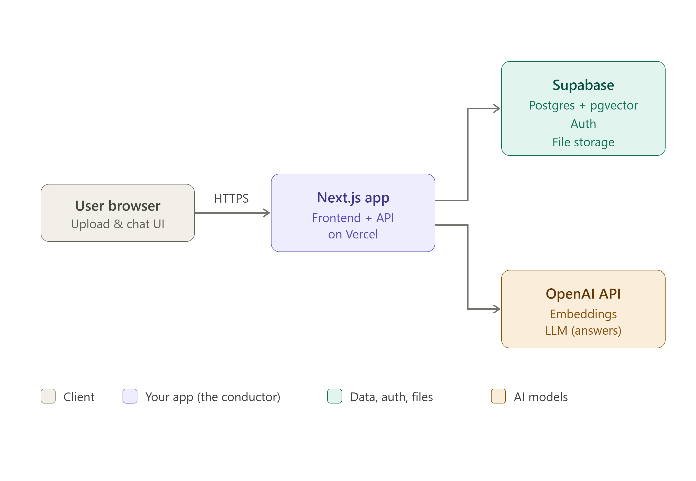

# Recall —  Architecture

This document explains how Recall is structured: the major components, how 
they fit together, and how data moves through the system during its two core 
operations (ingesting a document, and answering a question).

---

## Overview

Recall is an AI-powered study companion. A user uploads their own study 
materials (PDFs, slides, notes), and the app answers questions *grounded in those materials* 
using RAG (Retrieval-Augmented Generation), plus generates study aids like quizzes and 
flashcards. Each user's documents are private to their account.

The system has four parts:

1. **User browser** — the interface (upload screen, chat screen).
2. **Next.js app (on Vercel)** — the frontend *and* the backend. The 
   "conductor" that coordinates everything.
3. **Supabase** — the backend services: PostgreSQL database (with the pgvector extension), 
   user authentication, and file storage.
4. **OpenAI API** — the AI models: an embedding model (text -> vectors) and an LLM 
   (writes the final answers).

A key design point: the browser only ever talks to the Next.js app. The app is 
the only thing that talks to Supabase and OpenAI. This keeps secrets (API keys, 
DB credentials) on the server, never exposed to the browser.

---

## Components

### User browser
The client-side React UI built with Next.js. Two main screens: one to upload 
and manage documents, one to chat with them. It sends requests to the Next.js 
app over HTTPS and renders what comes back (including streaming answers).

### Next.js app (on Vercel)
The core of the system, and the only component that holds business logic. Unlike 
my GymFlow project (which had separate Express backend), Next.js combines 
frontend and backend in one project: React components for the UI, and API routes 
(server side code) for the logic. It is responsible for:
- Serving the UI.
- Handling uploads, extracting text from files.
- Splitting text into chunks and calling OpenAI to embed them.
- Reading/writing the database via Supabase.
- Running the RAQ query flow and streaming answers back to the browser.

Deployed on Vercel, which is purpose-built for hosting Next.js.

### Supabase
A backend-as-a-service bulding three things Recall needs, so they don't have to 
be wired up separately:
- **PostgreSQL + pgvector** — the database. pgvector is an extension that lets 
  Postgres store and search *vectors* (the numeric representation of meaning), 
  so the same database holds both normal relational data (users, documents) and 
  the AI search index.
- **Auth** — user signup/login and session management.
- **File storage** — where uploads PDFs are kept.

### OpenAI API
An external service called for two distinct jobs:
- **Embedding model** (`text-embedding-3-small`) — converts text into vectors.
  Used both when ingesting documents and when processing a user's question.
- **LLM** — reads the retrieved chunks plus the question and writes the answer.
  Used only in the query flow.

---

## Flow 1 — Ingestion (putting knowledge in)

This runs when a user uploads a document.

1. User uploads a PDF in the browser.
2. The Next.js app receives it and stores the file in Supabase storage.
3. The app extracts the raw text from the PDF.
4. The app splits the text into smaller **chunks** (a few hundred tokens each).
5. For each chunk, the app calls the OpenAi embedding model and gets back a 
   **vector** representing that chunk's meaning.
6. The app stores each chunk (its text + its vector + which document it came from) 
   in Postgres via pgvector.

After this, the document is "searchable by meaning" and the original PDF never 
needs to be read again fro Q&A.

---

## Flow 2 — Query (geting knowledge out) — this is RAG

This runs when a user asks a question.

1. User types a question in the chat.
2. The Next.js app embeds the **question** using the *same* OpenAI embedding 
   model. (Same model is required — vectors from different models aren't 
   comparable.)
3. The app asks Postgres/pgvector: "which stored chunk are closest in meaning 
   to this question vector? — a **vector similarity search**. Postgres returns 
   the top matching chunks.
4. The app builds a prompt: the user's questions + the retrieved chunks as 
   context.
5. The app sends that prompt to the OpenAI LLM, which writes an answer grounded 
   in the same provided chunks.
6. The answer streams back to the browser, ideally citing which document the 
   information came from.

The symmetry to notice: ingestion turns documents into vectors and stores them; 
querying turns a question into a vector and matches against them. The embedding 
model is the shared translator on both ends.

---

## Security notes
- API keys and DB credentials live only in the Next.js server environment, never 
  in browser code.
- Each user's documents are isolated to their account (enforced at the database 
  level — see DATABASE.md for row-level security).

Recall accepts untrusted input (uploaded files, user questions), so every input 
is treated as a potential attack surface. Core rule: never trust user input. 
Threats below are grouped by types, with the phase that addresses each.

### File upload threats
- **Wrong file type** — validate by content signature ("magic bytes") and MIME 
  type, NOT just the file extension (a malicious file can be renamed `.pdf`). 
  *Phase 2.*
- **Oversized files** — enforce a max file size, rejected before processing, to 
  protect storage and cost. *Phase 2.*
- **Malicious / malformed PDFs** — use a well-maintained PDF library; only ever 
  *extract text*, never execute anything from a file; isolate extraction so one 
  bad file can't crash the app. *Phase 2, hardened later.*

### AI-specific threads
- **Promp injection** — an uploaded document may contain text aimed at the LLM 
  ("ignore your instructions and..."). Since RAG feeds document text to the LLM 
  as context, this is a real risk. Mitigate by clearly separating instructions 
  from data in the prompt, constraining output, and not over-trusting model 
  output. *Designed for in Phase 4, hardened pre-launch.*
- **Cost / abuse attacks** — scripted high-volume requests to run up the OpenAI 
  bill. Mitigate with pre-user rate limited + a hard spending cap on the 
  OpenAI account. *Phase 4-6.*

### Web / multi-tenant threats
- **Data isolation (most critical)** — user A must never see user B's documents. 
  Every document query is scoped to the logged-in user, enforced at the database 
  level via Postgres row-level security (RLS) as a safety net even if a code 
  check is missed. *Phase 1 (built into the foundation).*
- **SQL injection** — parametrized queries only (same as GymFlow). *Ongoing.*
- **XSS** — sanitize any document text rendered in the browser. *Phase 4+.*

### Sequencing principle
Non-negotiable from day one (painful to retrofit): data isolation (RLS) and 
basic file validation (type + size). Design-for-now, harden-later: prompt 
injection, cost controls, advanced malicious-file handling. The core flow is 
built working first; defenses are layered in the order above.

## Open / future
- Streaming implementation details (how answers stream token-by-token).
- Caching embeddings to avoid re-embedding identical content.
- Rate limiting and per-user cost controls (pre-launch, if opening to real users).

