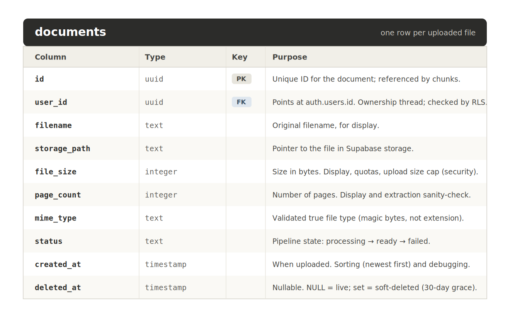

# Recall — Database Design

This document describes Recall's data model: the tables, what each column is
for, the relationships between tables, and the reasoning behind key decisions.
The machine-readable version lives in `schema.sql` (added when we start 
building). This file is the human "why" version.

The database is PostgreSQL (via Supabase) with the pgvector extension for 
vector search. See ARCHITECTURE.md for how the database fits into the system.

---

## Tables overview

- **auth.users** — managed by Supabase Auth. We don't create or modify this; we 
  reference it. Holds the user's id (UUID), email, hashed password, etc.
- **documents** — one row per uploaded file (metadata + pipeline status). [designed]
- **chunks** — one row per text chunk of a document, with its embedding vector. [next]
- **conversations** — one row per chat session. [designed on paper, build later]
- **messages** — one row per question/answer in a conversation. [designed on paper, built later]

Build order: document -> chunks (the lean core that makes RAG work), then 
conversations -> messages (chat history) added afterward.

---

## Relationships
- One `auth.users` row owns many `documents` (one-to-many).
- One `documents` row is split into many `chunks` (one-to-many).
- (Later) One `auth.users` row has many `conversations`; one `conversations` 
  row has many `messages`.

The `user_id` foreign key is the "ownership thread" — it's what row-level 
security checks to keep each user's data private (data isolation).

## Table: documents

One row per uploaded file. Stores metadata *about* the file; the file's actual 
bytes live in Supabase storage (this table points to them).

### Design decision for this table

**Metadata columns (file_size, page_count, mime_type):** include from the start 
because they're cheap to capture at upload time and useful for display, quotas, 
and security validation. Capturing them later would mean re-reading files.

**status:** an explicit pipeline state rather than inferring it. Lets the UI show 
"processing..." and makes failures visible (and loggable) instead of silent.

**Soft delete with 30-day grace period (deleted_at):** deleting a document sets 
`deleted_at` to the current time rather than removing the row. The app only shows 
documents where `deleted_at is NULL`. A schedule cleanup job permanently deletes 
rows whose `deleted_at` is more than 30 days old.
- *Why:* gives users a trash/undo window (safety against accidental loss), 
  preserves expensive embeddings during the window (a restore within 30 days is 
  free — no re-embedding cost), and still removes data eventually (privary + 
  storage cleanup). Best balance of the three concerns.
- *Cost:* every document-listing query must filter `deleted_at IS NULL`, and a 
  scheduled job must exist to do the permanent deletion (the timestamp alone 
  deletes nothing). The purge-eligible date is computed (deleted_at + 30 days), 
  not stored.

---

## Open / next
- Design the `chunks` table (introduces the pgvector `vector` type) — next session.
- Design `conversations` and `messages` on paper.
- Decide where the `deleted_at IS NULL` filter is enforced (per-query vs. a view 
  vs. RLS) when we build.
- Decide the chunk size / overlap strategy (a chunks-table concern).